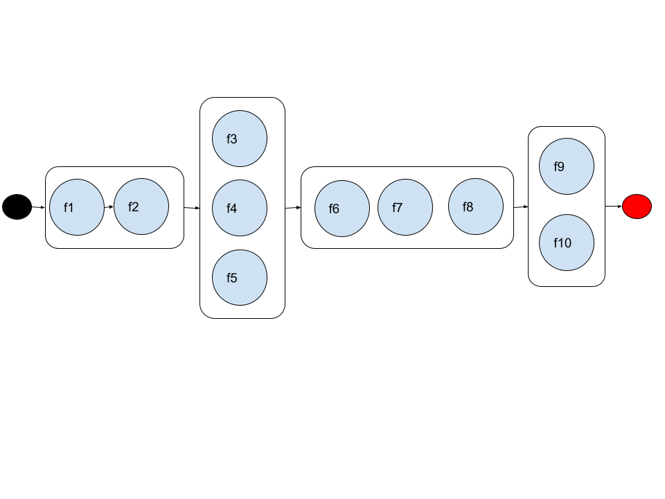

# dag_runner

dag_runner has two main concept:

1. **Pipeline** executes the functions sequentially and in order.
2. **Spawns**   executes the functions concurrently, so there is no ordering guarantee.

## Example 1

  
the example runs f1 and f2 sequentially then f3, f4, f5 in parallel then again f6,f7, f8 in sequence and finally f9, f10
in parallel

```python
dag = Dag()
dag.pipeline(f1, f2).then().spawns(f3, f4, f5).join().pipeline(f6, f7, f8).then().spawns(f9, f10).join()
dag.run()
```

the example runs f1 , f2 and f3 sequentially then f4, f5 in sequence then again f6,f7, f8 in parallel and finally f9,
f10 in parallel

```python
dag = Dag()
dag.spawns(f1, f2, f3).join().pipeline(f4, f5).then().spawns(f6, f7, f8).join().pipeline(f9, f10).then()
dag.run()
```

the example runs f1, f2, f3, f4, f5, f6, f7, f8 in sequence and finally f9, f10 in parallel

```python
dag = Dag()
dag.pipeline(f1, f2, f3, f4, f5, f6, f7, f8).then().spawns(f9, f10, ).join()
dag.run()
```

the example runs f1, f2, f3, f4, f5, f6, f7, f8 in parallel and finally f9, f10 in sequence

```python
dag = Dag()
dag.spawns(f1, f2, f3, f4, f5, f6, f7, f8).join().pipeline(f9, f10, ).then()
dag.run()
```

the example wraps (f1, f2, f3), (f4, f5, f6), (f7, f8) in sequence and finally f9, f10 in sequence

```python
dag = Dag()
dag.spawns(wrap_tasks(f1, f2, f3), wrap_tasks(f4, f5, f6), wrap_tasks(f7, f8)).join().pipeline(f9, f10, ).then()
dag.run()
```